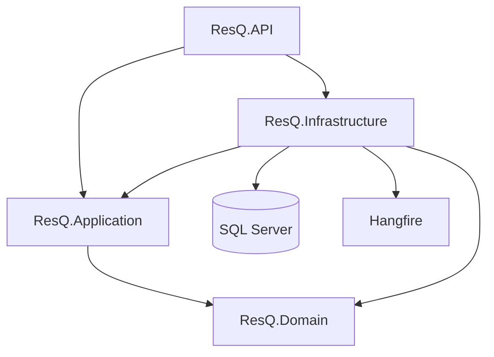
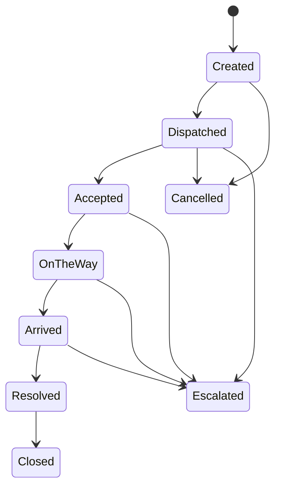
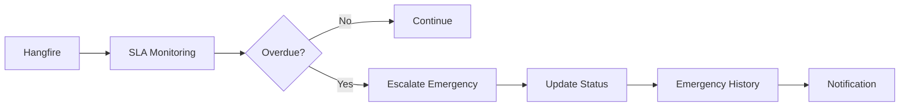

# 🚨 ResQ – Emergency Response & Dispatch Platform

ResQ is a backend platform for managing emergency incidents, dispatching specialized response teams, and coordinating the complete emergency response lifecycle through a secure, workflow-driven RESTful API.

The system combines **Clean Architecture, CQRS, role-based authorization, SLA monitoring, background processing, optimistic concurrency, audit history, notifications, and automated testing** to enforce the operational and security rules of an emergency-response platform.

---

## 🎯 Project Overview

ResQ provides a centralized backend for emergency response operations.

The system supports four main roles:

* **Citizen** – Creates and tracks personal emergencies.
* **Dispatcher** – Manages emergencies and dispatches response teams.
* **Response Team Member** – Executes missions assigned to their team.
* **Admin** – Performs administrative operations and manages system-level functionality.

The platform enforces:

* Authentication and authorization
* Resource ownership
* Team membership
* Emergency and mission state transitions
* Team availability
* SLA deadlines
* Concurrency protection
* Centralized exception handling
* Request validation

---

## 🏗️ Architecture

ResQ follows **Clean Architecture**, separating business logic from infrastructure and framework-specific concerns.



### Project Structure

```text
ResQ
│
├── ResQ.Domain
│   ├── Entities
│   ├── Enums
│   ├── Domain Rules
│   └── Exceptions
│
├── ResQ.Application
│   ├── CQRS
│   ├── Commands
│   ├── Queries
│   ├── Validators
│   ├── Behaviors
│   └── Interfaces
│
├── ResQ.Infrastructure
│   ├── EF Core
│   ├── SQL Server
│   ├── ASP.NET Identity
│   ├── JWT
│   ├── Persistence
│   └── Hangfire
│
└── ResQ.API
    ├── Controllers
    ├── Middleware
    ├── Authentication
    └── Swagger
```

### Dependency Flow

```text
API
 ↓
Application
 ↓
Domain

Infrastructure
 ↓
Application + Domain
```

The **Domain layer remains independent** from infrastructure and API concerns.

---

## 🛠️ Tech Stack

| Technology                | Purpose                  |
| ------------------------- | ------------------------ |
| C# / .NET 10              | Backend platform         |
| ASP.NET Core Web API      | REST API                 |
| Entity Framework Core     | ORM and data access      |
| SQL Server / LocalDB      | Database                 |
| ASP.NET Core Identity     | User and role management |
| JWT Bearer Authentication | Authentication           |
| MediatR                   | CQRS implementation      |
| FluentValidation          | Request validation       |
| Hangfire                  | Background jobs          |
| Swagger / OpenAPI         | API documentation        |
| xUnit                     | Automated testing        |
| Git / GitHub              | Version control          |

---

# 🔐 Authentication & Authorization

## Authentication

ResQ uses **ASP.NET Core Identity** and **JWT Bearer Authentication**.

Implemented features include:

* User registration
* User login
* Password hashing through ASP.NET Identity
* Login lockout after repeated failed attempts
* JWT-based authentication
* Roles included in JWT claims
* Swagger Bearer authentication

### Registration Security

Public registration is restricted to the **Citizen** role.

Users cannot publicly register themselves as:

* Dispatcher
* Response Team Member
* Admin

Privileged roles are controlled by the system rather than being freely assignable during registration.

---

## Authorization

ResQ implements **Role-Based Access Control (RBAC)** using:

```text
Citizen
Dispatcher
ResponseTeamMember
Admin
```

Authorization is not limited to `[Authorize]` attributes.

The application also performs **business-level authorization**.

Examples:

* Citizens can access their own emergencies.
* Dispatchers can manage emergency dispatch operations.
* Response Team Members can execute missions belonging to their team.
* Admins can access administrative functionality such as the Hangfire dashboard.

---

# 🚑 Emergency Management

The emergency API supports:

```text
POST /api/Emergencies
GET  /api/Emergencies/{id}
GET  /api/Emergencies/my
GET  /api/Emergencies/active
```

An `Emergency` contains information such as:

* Emergency Type
* Priority
* Status
* Description
* Location
* Tracking Number
* Response Deadline
* Citizen ownership
* RowVersion / concurrency token

---

## 🚨 Emergency Types

Emergency types determine the type of response team required.

The system uses:

```text
EmergencyType
RequiredTeamType
```

Before processing an emergency, the application validates that the referenced emergency type actually exists in the database.

This prevents invalid IDs from reaching the database layer and producing avoidable database exceptions.

---

# 🔄 Emergency Lifecycle

An emergency follows controlled state transitions rather than allowing arbitrary status updates.



The API validates whether each transition is allowed according to the business workflow.

This prevents invalid operations such as directly changing an emergency to an unrelated state.

---

# 👨‍🚒 Dispatch System

ResQ implements a complete dispatch workflow rather than treating dispatch as a simple status update.

Supported operations include:

* Assign team
* Reassign team
* Get available teams
* Accept mission
* Reject mission
* Start mission
* Arrive at scene
* Resolve emergency
* Close emergency
* Cancel emergency

```text
Emergency
    │
    ▼
Team Assignment
    │
    ▼
Mission Created
    │
    ▼
Accept
    │
    ▼
Start / EnRoute
    │
    ▼
Arrive / OnScene
    │
    ▼
Resolve
    │
    ▼
Close
```

---

# 🎯 Mission Management

A `Mission` represents the operational assignment of a response team to an emergency.

The mission lifecycle is:

```text
Assigned
   ↓
Accepted
   ↓
EnRoute
   ↓
OnScene
   ↓
Completed
```

An `Aborted` state can also be handled according to the workflow.

The system prevents multiple active missions from being created for the same emergency.

---

# 👥 Response Teams

Response teams are specialized according to their type:

* Medical
* Fire
* Police
* Rescue

Before assigning a team, the system validates:

* Team existence
* Required team type
* Team availability
* Team membership
* Existing active missions
* Emergency state
* Assignment rules

This ensures that only eligible teams can be assigned.

---

# 🔒 Ownership & Access Control

## Citizen Ownership

The system does not trust a client-provided `citizenId` to determine ownership.

Instead, the authenticated user's identity is extracted from the JWT:

```text
NameIdentifier / sub
```

The server then determines which resources belong to that user.

This protects against unauthorized access patterns such as **IDOR / Broken Object Level Authorization**.

---

## Team Membership Security

Response Team Members cannot rely on a `TeamId` supplied by the request or token alone.

The application verifies the **current database association** between the authenticated user and the response team.

This prevents unauthorized users from executing missions belonging to another team.

---

# ⏱️ SLA Monitoring

ResQ implements a priority-based SLA system.

Current response deadlines are:

| Priority | Response SLA |
| -------- | -----------: |
| Low      |  120 minutes |
| Medium   |   60 minutes |
| High     |   30 minutes |
| Critical |   10 minutes |

The calculated deadline is stored as:

```text
ResponseDeadline
```

when the emergency is created.

---

# 🚨 Automatic Escalation

ResQ uses **Hangfire** for background SLA monitoring.

A recurring job:

```text
sla-escalation-monitor
```

runs every minute and checks for overdue emergencies.



The workflow is implemented through application commands:

```text
MonitorOverdueEmergenciesCommand
            ↓
Find overdue emergencies
            ↓
EscalateEmergencyCommand
```

When an emergency exceeds its SLA, it can transition to:

```text
Escalated
```

The escalation process is designed to be idempotent to prevent repeated escalation of the same emergency.

---

# 📝 Emergency History

ResQ maintains an `EmergencyHistory` audit trail.

Important lifecycle events are recorded, including:

* Status transitions
* Dispatch-related actions
* SLA escalation

This preserves historical information instead of allowing previous state changes to disappear.

---

# 🔔 Notifications

The system includes an internal `Notification` mechanism.

For example, when an emergency is escalated because its SLA has been exceeded, a notification can be generated for the citizen.

Notifications include read/unread state:

```text
IsRead
```

---

# 🔄 CQRS & MediatR

ResQ uses **CQRS with MediatR** to separate commands from queries.

### Commands

Commands represent operations that modify application state:

```text
Command
   ↓
Command Handler
   ↓
Domain / Repository
   ↓
Database
```

### Queries

Queries represent read operations:

```text
Query
   ↓
Query Handler
   ↓
Repository / Data Access
   ↓
Response DTO
```

The application also uses a MediatR pipeline with:

```text
ValidationBehavior
```

and FluentValidation validators.

---

# ✅ Validation

Request validation is implemented using **FluentValidation** in the Application layer.

The MediatR pipeline uses asynchronous validation:

```csharp
ValidateAsync()
```

This allows validators to perform database-dependent checks when required.

Examples include:

* Required fields
* Valid emergency types
* Valid priorities
* Valid state transitions
* Valid assignments
* Database existence checks
* Business constraints

Validation errors are returned as structured API errors.

---

# 🔄 Optimistic Concurrency

ResQ uses EF Core's **RowVersion** mechanism for optimistic concurrency.

This protects operations where multiple users may attempt to update the same resource simultaneously.

Example:

```text
Dispatcher A → Assigns Team A
Dispatcher B → Assigns Team B
                   ↓
            Concurrent Update
```

Concurrency conflicts are handled explicitly rather than silently overwriting another update.

---

# 🆔 Tracking Numbers

Every emergency receives a unique tracking number.

The format evolved from timestamp-based identifiers to a timestamp combined with a GUID component:

```text
RSQ-202609240153-{GUID}
```

The database column was expanded from:

```text
nvarchar(30)
```

to:

```text
nvarchar(50)
```

to accommodate the new format.

A unique constraint/index is used to protect tracking number uniqueness.

---

# 🗄️ Database & EF Core

The project uses:

* Entity Framework Core
* SQL Server / LocalDB
* `ApplicationDbContext`
* Entity configurations
* Relationships
* Database indexes
* Unique tracking number constraint
* RowVersion concurrency
* EF Core migrations

Database schema changes are managed through EF Core migrations.

---

# 👤 Identity & Role Seeding

ResQ includes role seeding for the application's predefined roles.

Role creation checks the result of:

```csharp
IdentityResult.Succeeded
```

If role creation fails, the application throws a clear exception containing the relevant failure information instead of silently continuing.

---

# 🛡️ Exception Handling

The API uses centralized exception handling through:

```text
ApiExceptionHandler
```

### Validation Errors

Returned as:

```text
400 Bad Request
```

using `ValidationProblemDetails`.

### Missing Resources

Returned as:

```text
404 Not Found
```

### Unexpected Errors

Returned as:

```text
500 Internal Server Error
```

Internal exception details are not exposed to API consumers.

---

# 🔑 JWT Security Hardening

The JWT signing key is validated during application startup.

The application requires a signing key of at least:

```text
32 UTF-8 bytes
```

Security-related configuration includes:

* JWT secret validation
* User Secrets for development
* No JWT secret stored in normal application configuration
* JWT Bearer validation

---

# 🔐 Secrets Management

Sensitive development configuration uses **.NET User Secrets**.

The project uses:

```text
UserSecretsId
```

for local secret management.

The JWT signing secret is stored outside the normal source configuration.

> Before production deployment, any previously exposed credentials or signing keys must be rotated and removed from repository history where applicable.

---

# 📄 Swagger / OpenAPI

ResQ provides API documentation through **Swagger / OpenAPI**.

Swagger includes:

* JWT Bearer authentication
* Endpoint documentation
* Request and response information
* Authorization information
* XML documentation
* Response type metadata

The API uses XML documentation files:

```text
ResQ.API.xml
ResQ.Application.xml
```

Controllers and endpoints include documentation such as:

```xml
<summary>
<param>
<returns>
<response>
<remarks>
```

and response metadata through:

```csharp
[ProducesResponseType(...)]
```

---

# 📑 Pagination

The API includes actual pagination for emergency queries.

The application uses:

```text
PagedResult<T>
```

containing:

* `Items`
* `TotalCount`
* `PageNumber`
* `PageSize`
* `TotalPages`
* `HasNextPage`
* `HasPreviousPage`

Example:

```http
GET /api/Emergencies/my?pageNumber=2&pageSize=10
```

---

# 📡 API Endpoints

The current API contains **18 endpoints**.

## Authentication — 2

```http
POST /api/Auth/register
POST /api/Auth/login
```

## Emergencies — 4

```http
POST /api/Emergencies
GET  /api/Emergencies/{id}
GET  /api/Emergencies/my
GET  /api/Emergencies/active
```

## Dispatch / Missions — 12

```http
POST /api/emergencies/{id}/assign
POST /api/emergencies/{id}/reassign
POST /api/emergencies/{id}/accept
POST /api/emergencies/{id}/reject
POST /api/emergencies/{id}/start
POST /api/emergencies/{id}/arrive
POST /api/emergencies/{id}/resolve
POST /api/emergencies/{id}/close
POST /api/emergencies/{id}/cancel

GET  /api/emergencies/{id}/available-teams
GET  /api/emergencies/{id}/history
GET  /api/missions
```

---

# ⏲️ Hangfire Dashboard

The Hangfire dashboard is available at:

```text
/hangfire
```

Access is restricted to the **Admin** role.

The dashboard provides visibility into background processing, including the recurring SLA monitoring job.

---

# 🧪 Automated Testing

The project includes a dedicated:

```text
ResQ.Tests
```

test project using **xUnit**.

The final recorded test result is:

```text
46 tests
46 passed
0 failed
0 skipped
```

The test suite covers areas including:

* Emergency workflow
* Mission workflow
* SLA calculations
* Escalation
* Notifications
* Dispatch
* Assignment validation
* Ownership
* Team membership
* Registration roles
* Request validation
* Exception handling
* Role seeding
* JWT key validation
* Tracking number uniqueness

---

# ⚙️ Getting Started

## Prerequisites

Make sure you have:

* .NET 10 SDK
* SQL Server or LocalDB
* Git

## 1. Clone the Repository

```bash
git clone https://github.com/Reham-44/ResQ.git
cd ResQ
```

## 2. Configure Development Secrets

Set the JWT signing key using .NET User Secrets:

```bash
dotnet user-secrets set "JwtSettings:SecretKey" "YOUR_SECRET_KEY"
```

Use a strong randomly generated signing key.

Do not commit real secrets to source control.

## 3. Configure the Database

Configure the development database connection according to the project's development configuration.

Make sure SQL Server or LocalDB is available.

## 4. Apply Migrations

```bash
dotnet ef database update \
  --project ResQ.Infrastructure \
  --startup-project ResQ.API
```

## 5. Run the API

```bash
dotnet run --project ResQ.API
```

## 6. Open Swagger

Open the Swagger URL displayed by the application.

Example:

```text
https://localhost:7078/swagger
```

The port may vary depending on the local launch configuration.

---

# 🗂️ Main Domain Components

### Emergency

Represents an emergency incident.

Key information includes:

* Emergency type
* Priority
* Status
* Tracking number
* Response deadline
* Location
* Citizen ownership
* Creation time

### ResponseTeam

Represents a specialized emergency response team.

It manages:

* Team type
* Availability
* Team members
* Assignment eligibility

### Mission

Represents the assignment of a response team to an emergency and manages the operational mission workflow.

### EmergencyHistory

Stores important events and state changes throughout the emergency lifecycle.

### Notification

Stores notifications generated by the system and their read/unread state.

---

# 🔒 Security Notes

The application applies multiple layers of security:

* JWT authentication
* Role-based authorization
* Ownership validation
* Team membership validation
* Login lockout
* JWT signing key validation
* Centralized exception handling
* Secret management
* Optimistic concurrency

Sensitive configuration should not be stored directly in source-controlled configuration files.

For local development, use:

```bash
dotnet user-secrets
```

Before production deployment:

* Rotate any exposed credentials or signing keys.
* Remove sensitive credentials from repository history where applicable.
* Use production-grade secret management.
* Configure appropriate database credentials and access policies.

---

# 🚀 Future Improvements

Potential extensions include:

* Real-time notifications using SignalR
* Redis caching
* Centralized structured logging
* Distributed tracing
* External SMS / push notification providers
* Cloud deployment
* SQL Server integration testing
* API rate limiting
* Monitoring and observability

These are **future extensions** and are not represented as currently implemented features.

---

# 📌 Project Highlights

ResQ demonstrates practical backend engineering concepts including:

```text
.NET 10
ASP.NET Core Web API
Clean Architecture
CQRS / MediatR
Entity Framework Core
SQL Server
ASP.NET Core Identity
JWT Authentication
Role-Based Authorization
FluentValidation
Hangfire
SLA Monitoring
Automatic Escalation
Optimistic Concurrency
Audit History
Notifications
Pagination
Swagger / OpenAPI
Centralized Exception Handling
Automated Testing
```

The project focuses on implementing a secure and maintainable backend for a stateful emergency-response workflow, with business rules enforced at the application level.

---

# 👩‍💻 Author

**Reham Abdelrahman**

Computer Science Student | .NET Backend Developer
